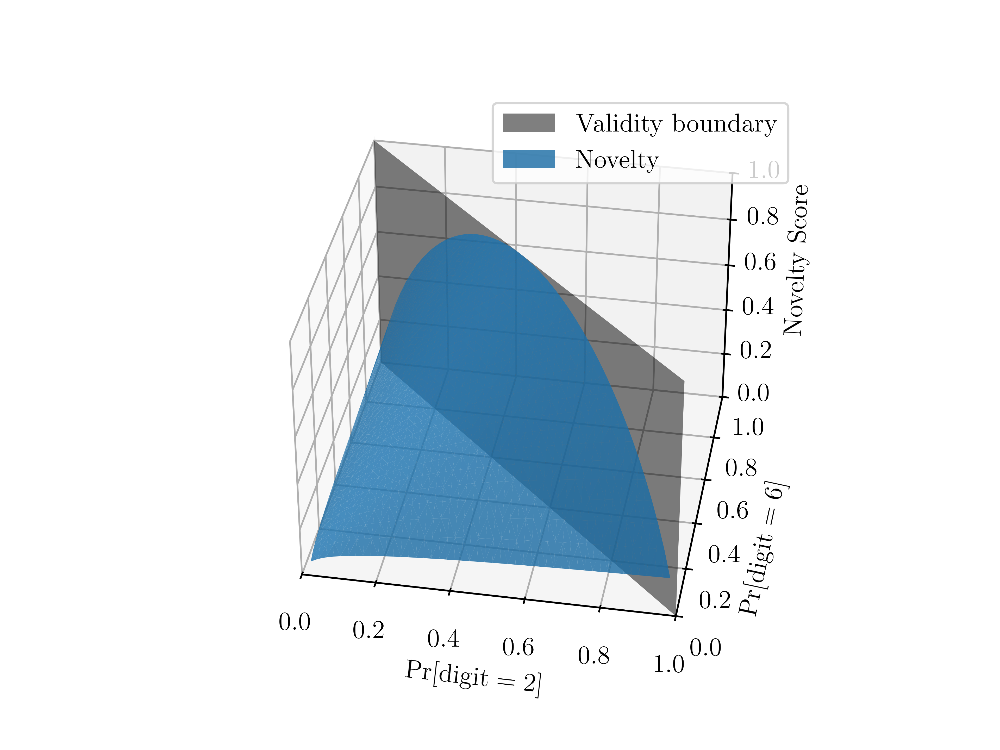

# Digit4
In this project, we create a generative model to create digits that are neither 2 nor 6, but something in between. We also want the digits to look creative, and have a tradeoff between creativity and accuracy.

## Setup
First, install the dependencies. The version of `torch` specified in `requirements_torch.txt` is optimized for CPU; if you have a GPU present, adjust the `-i` directive at the top. You can find which URL to use by looking at the install command generated by [`torch`'s setup page](https://pytorch.org/get-started/locally/).

Once you've tweaked that, you should be able to install through `pip` (possibly in a `venv`, if that suits your fancy):
```console
(venv) user@host:~$ pip3 install -r requirements_torch.txt 
Looking in indexes: https://download.pytorch.org/whl/cpu
...
(venv) user@host:~$ pip3 install -r requirements.txt 
Collecting einops (from -r requirements.txt (line 1))
...
```
You may notice that we have an empty folder, `data`. This is intended to be where `torch` will download the EMNIST dataset.

Be aware, all the files were run on a cluster node with four GPUs, so you might need to adjust the CUDA device settings in each of the scripts before they'll run correctly.
## Generating Images
We don't recommend that you do this unless you're willing to spend a few hours letting it run. We have pre-generated 10000 images with each method, which we've stored in the `output/` folder. We recommend skipping to [Scoring Images](#scoring-images) and continuing with those pretrained ones.
### VAE Interpolation
Run `src/generate_vae_interp.py`.
### VAE With Latent Optimization and Creative VAE With Latent Optimization
Run `src/creative_vae.ipynb`. Note that this requires the novelty CNN to be already trained.
### Diffusion
Run `src/generate_diffusion.py`. Note that this requires both the diffusion model and the EMNIST classifer (for Value) to be trained. It also must be run on GPUs. We've included pretrained models in the repo.
## Scoring Images
To score the pre-generated images, run `src/compare_methods.py`. It will display some figures interactively, showing random selections from each image set, along with the top-scoring ones. It will also save these images (along with all the scores) in the `analysis/` folder.

## Score Model Training
Our score function makes use of several pretrained models. If you would like to train them yourself, we provide some scripts for that. Be aware, this will take a while, so we don't recommend it.
### GAN for Value
Run `src/train_value_gan.py`.
### Optional CNN for Value
We didn't end up using this, but we also trained a CNN to classify whether something is a digit. You can train it by running `src/train_value_cnn.py`, but it won't be used unless you pass `use_discriminator = False` to the `DeepCreativity` constructor.
### CNN for Novelty
Run `src/train_novelty_cnn.py`.
### VAE for Surprise
Surprise doesn't need an extra model trained; it uses the base VAE. If you haven't done so already, run `src/train_base_vae.py`.

## Generative Model Training
Again, we don't recommend training these. But if you'd like to, feel free.
### VAE Interpolation
Run `src/train_base_vae.py`.
### VAE with Latent Optimization Creative VAE With Latent Optimization
This is performed within the `src/creative_vae.ipynb`.
### Diffusion
We strongly recommend against training this one yourself, It took us 8 hours on 4xRTX4000. If you really want to, run `src/train_diffusion.py`.
# Background
## Scoring Function
Our scoring function has three components: value, novelty, and surprise. Our metrics were inspired by [Deep Creativity (G. Franceschelli and M. Musolesi, 2022)](https://www.mircomusolesi.org/papers/ia22_deepcreativity.pdf).
### Value
Value answers the question: "how much does this look like a digit?" It is a measure of how similar a given image looks to the real digit distribution. This similarity is quantified by the discriminator of a GAN, which we trained as part of this project. The GAN was trained on the digits from the EMNIST dataset, enhanced with random rotations, translations, and scalings applied. Value is defined as the output of that discriminator: essentially, the GAN's level of certainty that the input image is real (from the EMNIST dataset) rather than generated.

### Novelty
Novelty tries to grasp how uncertain we are about which digit (2 or 6) this is. After a few tries, we settled on the formula:

$$\text{Novelty}(p_2, p_6)=-\left(p_2\log_2\left(\frac{p_2}{p_2+p_6}\right)+p_6\log_2\left(\frac{p_6}{p_2+p_6}\right)\right)$$

Note that this is equivalent to:

$$\textrm{Novelty}(p_2, p_6) = H(\tilde{p}_2, \tilde{p}_6) (p_2 + p_6)$$\
$$H(\tilde{p}_2, \tilde{p}_6) = -\frac{\tilde{p}_2\ln\tilde{p}_2 + \tilde{p}_6\ln\tilde{p}_6}{\ln 2}$$\
$$\tilde{p}_n=\frac{p_n}{p_2+p_6}$$

Where $p_2$ and $p_6$ are the probabilities that an image is a 2 or 6, respectively, based on the output of a pre-trained digit classifier. The classifier was trained on mixed-up images of 2 and 6, in various proportions.

A plot of the novelty function is shown below. Note that the maximum occurs at $(0.5,0.5),$ the function appears convex, and all other points have smooth paths of gradient ascent to the maximum. If you'd like to explore this more, run `images/novelty.py` and play with the interactive 3D plot.

### Surprise
Surprise is meant to measure how strange a data point looks. We quantified this by using KL divergence to estimate how far off of the latent space's mean we are.

$$S(x, z)=1-\exp\left(-\lambda\cdot D_{KL}\left(q_\phi(z|x)\Vert p(z)\right)\right)$$

### Total Score
The total score is the product of these three, to prevent the model from neglecting any of them:

$$\text{Score} = V\cdot N\cdot S$$
